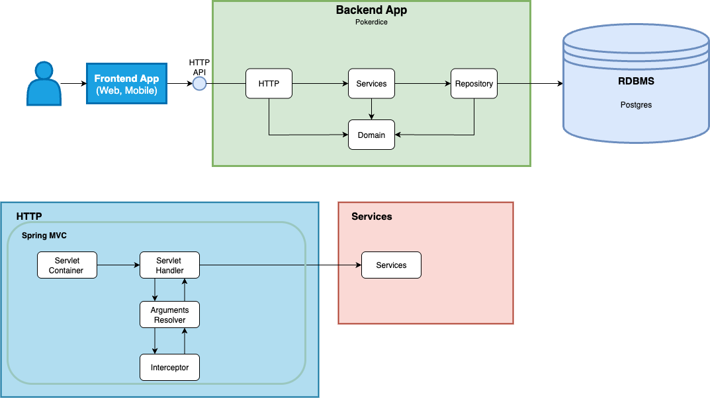

# PokerDice

A multiplayer poker-dice web application built as a modular Kotlin/Spring Boot backend with a React client, PostgreSQL persistence, and a containerized two-node deployment behind Nginx.

## What this project demonstrates

- Layered backend design across domain, services, HTTP, repository, and JDBI modules
- Server-side authentication, lobbies, matches, rounds, turns, rolls, and hand evaluation
- REST API documented with OpenAPI in [`docs/api.yaml`](docs/api.yaml)
- React single-page application served through Nginx
- Two backend replicas sharing PostgreSQL state
- Docker Compose deployment and Nginx round-robin load balancing
- Explicit transaction boundaries through the repository layer



## Architecture

| Component | Responsibility |
| --- | --- |
| `react` | Browser client |
| `http` | REST controllers, request models, authentication, and error responses |
| `services` | Application workflows and game orchestration |
| `domain` | Game rules, entities, value objects, and hand evaluation |
| `repository` | Persistence contracts and transaction abstractions |
| `repository-jdbi` | PostgreSQL/JDBI implementation |
| `host` | Spring Boot application and runtime configuration |
| Nginx | Static content, reverse proxy, and load balancing |
| PostgreSQL | Shared persistent state |

## Run locally

Requirements: Git and Docker Desktop (or Docker Engine with Compose).

```bash
git clone https://github.com/Simao123456/PokerDice-Game.git
cd PokerDice-Game
docker compose up -d --build
```

Open <http://localhost:8080>. API requests are available below `/api`.

To watch requests across both backend replicas:

```bash
docker compose logs -f backend-1 backend-2
```

To stop the environment:

```bash
docker compose down
```

## Testing and current limitations

The repository currently contains a Spring application-context smoke test. The game rules, service workflows, persistence behavior, and concurrent requests are not yet covered by an automated test suite.

Because both backend replicas operate on shared game state, production hardening should include integration tests for simultaneous joins, rolls, and turn transitions, backed by explicit database constraints or locking where appropriate. This README does not claim those race conditions are already resolved.

## Documentation

- [OpenAPI specification](docs/api.yaml)
- [Architecture source](docs/Diagram.drawio)
- [Architecture diagram](docs/Diagram.png)

## Academic context

This is an academic software-engineering project. The repository is presented as implemented and retains its original history and structure.
